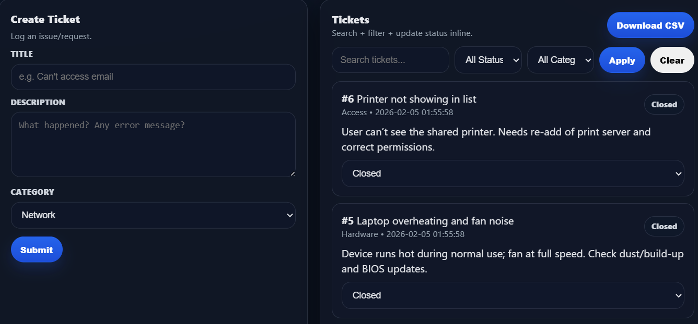
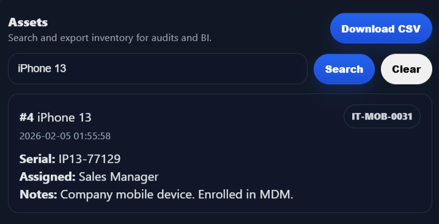
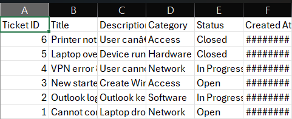

# DevDesk (IT Ops Tool)

DevDesk is an internal IT operations tool for managing **support tickets**, a **knowledge base**, and **asset inventory**. 

## Features

- ✅ Tickets: create, list, update status (Open / In Progress / Closed)
- ✅ Knowledge Base: create and browse articles
- ✅ Asset Tracker: add and view devices/assets
- ✅ Search & Filters:
  - Tickets: keyword + status + category
  - KB: keyword search (title/content/tags)
  - Assets: keyword search (name/tag/serial/assigned/notes)
- ✅ CSV export:
  - Tickets → `tickets.csv`
  - KB → `knowledge_base.csv`
  - Assets → `assets.csv`

## Tech Stack

- **Backend:** Node.js + Express
- **Database:** SQLite (file-based)
- **Frontend:** Vanilla HTML/CSS/JavaScript (single-page UI)

## Getting Started (Local)

## Screenshots

### Tickets & Filters


### Knowledge Base


### Assets


### CSV Export (Excel)


### 1) Install dependencies
```bash
npm install

